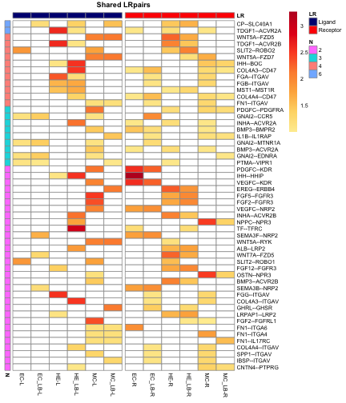
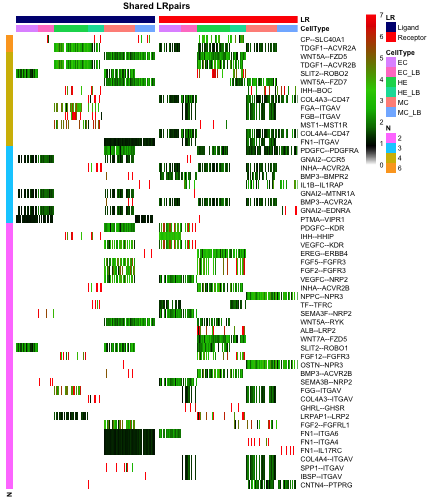

## Introduction
Ligand-Receptor based Cell-Cell Communication (`LRC3`) is a tool for detecting and visualizing the communication between different cell types based on the expression of ligands and receptors of scRNASeq data. `LRC3` achieves high accuracy and robustness through multiple steps of significance test. A contact matrix provides a good framework to visualize the communication among cell types in both ligand-to-receptor (OUT signal) and receptor-to-ligand (IN signal) separately. The detailed signalling pathways between cell types are extracted and displayed out based on both the mean expression level and the proportion of cells that significantly express the corresponding signalling pathway. `LRC3` also provides searching function for users to query the detailed communication pathways between any pairwise cell types. It can be applied to any scRNA-seq datasets for which a list of ligand-receptor interactions is available. This package provides curated lists for human and mouse.

## 1 Data Preparation

The input for `LRC3` requires a matrix containing expression data of scRNASeq, with column names the matrix assigned as the cell types and row names the gene names. A `Sampledata` is provided in LRC3 for illustration. This is a subset from the dataset produced by Gray Camp(https://www.nature.com/articles/nature22796) which contains the log2(FPKM) gene expression of 465 cells from liver bud and it contains 6 cell types.


```r
library(LRC3)
SampleData[1:5,1:10]
```

```
##                HE       EC     MC-LB       MC        HE       HE       EC
## SLC9A2   0.000000 0.000000 2.0960931 0.000000 0.0000000 0.000000 0.000000
## MFSD9    4.463282 2.998358 0.1757481 0.000000 0.0000000 0.000000 0.000000
## TMEM182  0.000000 4.938403 0.3318542 0.000000 0.0000000 0.000000 0.000000
## MRPS9    0.000000 3.056393 0.0000000 3.633489 0.4432247 5.368789 5.855182
## TGFBRAP1 0.000000 2.015765 0.0000000 0.000000 0.0000000 0.000000 2.492202
##             EC-LB MC-LB       MC
## SLC9A2   0.000000     0 0.000000
## MFSD9    0.000000     0 0.000000
## TMEM182  0.000000     0 0.000000
## MRPS9    0.000000     0 3.562853
## TGFBRAP1 3.423255     0 0.000000
```
Note that the column names of the matrix should be the cell types names. The cell type names are suggested to be short abbreviation of the full name as shown in the `Sampledata`for better visualization. 


```r
data_list <- PrepareData(SampleData)
data_list[[1]][1:5,1:5]
```

```
##              3 1 6 5 3
## EDAR  0.000000 0 0 0 0
## MERTK 0.000000 0 0 0 0
## IL1A  0.000000 0 0 0 0
## IL1B  2.883707 0 0 0 0
## IL1RN 0.000000 0 0 0 0
```

```r
data_list[[2]][1:5]
```

```
## [1] 3 1 6 5 3
```

```r
data_list[[3]][1:5]
```

```
## [1] "EC"    "EC_LB" "HE"    "HE_LB" "MC"
```
## 2 Calculation of the Contact Information

`LRC3_INF` will perform calculations on communication between different cell types. Users could choose from two different types of threshold to define a contact between two cell types: the `Pval` which is gained through a permutation process, and the `FixedThreshold` which is a fixed threshold that could be defined by the user. The default is using a Pval as a threshold with a significance of 0.95. Users can then choose from two different ways of testing the significance of the contacts. One default option is `Ptest` which tests the significance of each contacts with a default threshold 0.01. The other way is to test the significance of each total contact number between pairwise cell types and a threshold of contact number is generated with a default significance of 0.01. A curated ligand-receptor list by Ramilowski (https://www.nature.com/articles/ncomms8866) is used here and is included in this package.


```r
head(LRpairs)
```

```
##   Ligand.ApprovedSymbol Receptor.ApprovedSymbol
## 1                   A2M                    LRP1
## 2                 AANAT                  MTNR1A
## 3                 AANAT                  MTNR1B
## 4                   ACE                   AGTR2
## 5                   ACE                  BDKRB2
## 6                ADAM10                     AXL
```

Using all default parameters, we can take the `Sampledata` within this package and run `LRC3` as an example. The result from the previous data preparation step `data_list` will be taken as the input data.


```r
LRC3_list <- LRC3_INF(data_list)
```


`LRC3_INF` will perform calculation on the input dataset and construct frameworks of the connection information between cell types. When we run LRC3 on a MacBook Pro laptop 2015, it takes about 8 seconds to run this step for the sample data set. For normal scRNASeq data containing about 500 hundred cells with less than 10 cell types, it takes about 1-2 minutes to run. For datasets with 2000 cells and less than 10 cell types, it takes about 4-5 minutes. For datasets with 8000 cells and less than 10 cell types, it takes about 20-30 minutes. The calculation time for datasets with different number of cell types varies with more cell types consuming longer time. The maximum number of cell types for the current version of LRC3 is set as 100.


## 3 The contact matrix

Users can then use the contact matrix to visualize the communication between cell types. The framework of contact matrix provides an efficient structure to view the communication in both IN and OUT direction separately. We shall take the results from the `Sampledata` as an example.


```r
LRC3_ContactMatrixPlot(LRC3_list,IndexNumber =1)
```


The plot is constructed as this: both the horizontal and vertical axis are cell types, each position (i,j) in the plot represents the signal direction from the ith cell type to the jth cell type(ith cell type express ligand and jth cell type express receptor), hence the diagonal represents self-communication, the pairs of position that symmetric to the diagonal represent the IN and OUT signalling for the corresponding cell pairs. Each row vector represents OUT signals for the row cell type, while each column vector represents IN signals for the column cell type. The colour represents contact number, ie the number of significant LR pairs. From the figure above, we can tell that the contacts between `HE_LB` to `MC` have the strongest signal. 

By setting the parameter of `IndexNumber`, the `LRC3_ContactMatrixPlot` function could provide 4 types of contact matrix. The 1st one (default) is the raw counts of the contact numbers. The 2nd is the contact number scaled by a factor of the threshold of the corresponding gene. It could be able to tell some differences when some signalling pathways expressed much stronger than the threshold. The 3rd is a non-directional plot of contact numbers, with each position showing the total contact number between the corresponding pairs of cell types. The 4th is the total scaled contact number without directions.


## 4 Visualizing connections between all cell types

In order to view the detailed signalling pathways among cell types, we extract the signals for each ligand-receptor pair among all cell types and construct several frameworks to visualize the connections. Based on the frequency of the ligand-receptor pairs that are used among cell types, the signalling pathways are separated and displayed in two parts: Shared LRpairs and Unique LRpairs, where Shared LRpairs is the ligand-receptor pairs that are used by more than 1 times among cell types, and Unique LRpairs is the pairs that are uniquely used by one pair of cell types. Users can choose to show the connections either by the mean expression value of cell types or the proportion of cells that significantly express the pathways. A framework providing the connection numbers for each cell type at a specific ligand-receptor pairs is also constructed. It could give an indication of contacts that has been removed during the significance test.

To view the connections of frequently used pathways, users should set the `IndexOfPlot = 1` in the `LRC3_Connection` function. If the ligand-receptor pairs are much more than 50, users can choose to set the `MultiFigure = TRUE` to plot the results in multiple figures.


```r
LRC3_Connection(LRC3_list,IndexOfPlot = 1)
```



In this figure, the LRpairs are ranked first by the usage frequency and then by their mean expression value. The left panel is cell types that express ligand, and right panel is the cell types that express the corresponding receptor. The N in the figure represents the usage frequency, colour bar represents the mean expression value. Row names are the pathways and column names are cell types.

To view the connections by the proportion of cells that significantly express the pathways, users should set the `By_Proportion = TRUE`.


```r
LRC3_Connection(LRC3_list,IndexOfPlot = 1,By_Proportion = TRUE)
```



In this figure, the LRpairs are also ranked first by the usage frequency and then by their mean expression value. Each column is a single cell. Colour bar represents the expression value of cells that significantly express the pathway. Hence, from this figure, users can get a clear information on how many cells in a cell type significantly express the pathway as well as their expression value.

If the users are interested to view the connection number for each of the cell type at certain pathways, you should set the `IndexOfPlot = 2`. Here in this figure, the colour bar represents the connection number of the corresponding cell types.

```r
LRC3_Connection(LRC3_list,IndexOfPlot = 2)
```


To view the connections of uniquely used pathways, users should set the `IndexOfPlot = 3` to see the pairs that are uniquely used by one pair of cell types. The LRpairs are ranked by their mean expression value. The left panel is cell types that express ligand, and right panel is the cell types that express the corresponding receptor. The colour bar represents the mean expression value. Row names are the pathways and column names are cell types. If the ligand-receptor pairs are much more than 50, users can choose to set the `ViewTop_UniqLRpairs = TRUE` to view a number of top LRparis. The number could be set using parameter `NumberForTopUniq` and the default number is 50 pairs.

```r
LRC3_Connection(LRC3_list,IndexOfPlot = 3)
```


To view the connections by the proportion of cells that significantly express the pathways, users should set the `By_Proportion = TRUE`.

```r
LRC3_Connection(LRC3_list,IndexOfPlot = 3,By_Proportion = TRUE)
```


## 5 Visualizing connections for a specific cell type

`LRC3` package also provides frameworks to view the connections between a target cell type and all the other cell types. For a particularly cell type, `LRC3` will extract both the IN and OUT signals for the target cell type and construct frameworks to display them either separately or combined. Users can choose to view the connections either by the mean expression value of cell types or the proportion of cells that significantly express the pathways.

To view the connections for a particular cell type, users need to set a parameter `CellType_Index`. The cell type names are sorted alphabetically in the programme. Users need to input a number representing the order for the cell type that you are in interested in. The cell type order on the contact matrix could provide as a reference. Users can view the IN and OUT signal separately or both direction combined as well, by setting parameters `TargetCellType_IN = TRUE`, `TargetCellType_OUT = TRUE`,`Combine_InOut = TRUE`. 

In the IN figure, it shows all the signals that comes into this cell type, which means the target cell type express the receptor signal and all the other cell types express the ligand signal. The target cell type is on the first column of the figure and all the other cell types are on the right. The signalling pathways are first ordered by the usage frequency N and then by the mean expression value of the ligand-receptor pairs. The colour bar represents the mean expression value of the corresponding gene in the cell types. In the OUT figure, the target cell type expressing ligands is on the first column and all the other cell types expressing receptors are on the right columns. The InOut figure combines the two types of signals together with the left half panel displaying the IN signal and right half panel displaying the OUT signal. The pathways are ranked first by the usage frequency N and then by the mean expression value.


```r
LRC3_CellTypeConnection(LRC3_list,CellType_Index = 1,TargetCellType_IN = TRUE)
```


```r
LRC3_CellTypeConnection(LRC3_list,CellType_Index = 1,
                        TargetCellType_OUT = TRUE)
```


```r
LRC3_CellTypeConnection(LRC3_list,CellType_Index = 1,Combine_InOut = TRUE)
```


To view the cell type specific connections by the proportion of cells that significantly express the pathways, users should in addition set the `By_Proportion = TRUE`. 

```r
LRC3_CellTypeConnection(LRC3_list,CellType_Index = 1,TargetCellType_IN = TRUE,
                        By_Proportion = TRUE)
```


```r
LRC3_CellTypeConnection(LRC3_list,CellType_Index = 1,
                        TargetCellType_OUT = TRUE,By_Proportion = TRUE)
```


```r
LRC3_CellTypeConnection(LRC3_list,CellType_Index = 1,Combine_InOut = TRUE,By_Proportion = TRUE)
```


## 6 Different parameter sets in the `LRC3_INF` calculation

`LRC3` provides multiple combination of parameter sets to calculate the communication between cell types in `LRC3_INF` function. As described in part 2, users can choose either `Pval` or `FixedThreshold` as a threshold to define a contact by setting `PvalAsThreshold = FALSE`. The threshold for `Pvalue` can also be increased to 0.99 when users want to detect LRpairs that are more significant. For example,

```r
LRC3_list <- LRC3_INF(data_list,PercentForPval = 0.99)
LRC3_ContactMatrixPlot(LRC3_list,IndexNumber =1)
```


Users can choose a fixed threshold for calculating the contacts by setting `Pval = FALSE` and then give a value for the `FixedThreshold`.  For the `Sampledata` in the original paper, they choose log2(FPKM) = 1 or choose log2(FPKM) = 5 as threshold to define a contact. This value could be adjusted to the needs of users. Larger number means a higher level of expression value to define a contact. When the users are using the TPM rather than log2(FPKM), users could set 5TMP or 30TPM as was used in a study by Pavličev etc. (https://www.ncbi.nlm.nih.gov/pmc/articles/PMC5340963/).


```r
LRC3_list <- LRC3_INF(data_list,PvalAsThreshold = FALSE, FixedThreshold = 1)
LRC3_ContactMatrixPlot(LRC3_list,IndexNumber =1)
```


## 7 Query the contact pathways for pairwise cell types and a detailed total list

`LRC3` provides query function for users to view a detailed list of the pathways that used among all pairwise cell types, as well as the signal strength which is the mean scaled expression of the signalling pathway. Users need to input two numbers representing two different cell types. The first number represents the cell type that expresses ligands and the second number represents the cell type that expresses receptors. For example, to view the contacts from cell type 4 to cell type 5:


```r
LRC3_LRPairsCellTypeSearch(LRC3_list,CellType1 = 4,CellType2 = 5)
```

```
##          1   
## Ligand   TF  
## Receptor TFRC
## Signal   2.4
```

to view the contacts from cell type 5 to cell type 4:

```r
LRC3_LRPairsCellTypeSearch(LRC3_list,CellType1 = 5,CellType2 = 4)
```

```
##          1     2      3     4    
## Ligand   FGF5  LRPAP1 SLIT2 FGF2 
## Receptor FGFR3 LRP2   ROBO2 FGFR3
## Signal   2.7   2.7    2.6   1.8
```
The results are ordered by the mean signal of the ligand-receptor pairs.

`LRC3` also has function that can produce a detailed total list to users for further analysis.

```r
TotalListOfLRpairs <- LRC3_TotalListOfLRpairs(LRC3_list)
TotalListOfLRpairs[1:20,]
```

```
##    Ligand Receptor Signal L_Signal R_Signal L_Origin R_Origin L_Thresh
## 1   PDGFC      KDR   1.84     1.38     2.30   1.3836   2.2953        1
## 2   PDGFC      KDR   1.70     1.38     2.02   1.3836   2.0198        1
## 3   SLIT2    ROBO2   2.67     4.16     1.19   4.1567   1.1892        1
## 4  LRPAP1     LRP2   2.66     4.31     1.00   4.3069   1.0044        1
## 5   VEGFC      KDR   1.81     1.33     2.30   1.3293   2.2953        1
## 6   VEGFC      KDR   1.67     1.33     2.02   1.3293   2.0198        1
## 7  LRPAP1     LRP2   2.02     3.04     1.00   3.0392   1.0044        1
## 8   SLIT2    ROBO2   1.12     1.05     1.19   1.0545   1.1892        1
## 9     FGB    ITGAV   2.58     1.53     3.63   1.5346   3.6253        1
## 10    FGB    ITGAV   2.84     1.53     4.15   1.5346   4.1541        1
## 11    FGB    ITGAV   1.59     1.53     1.65   1.5346   1.6459        1
## 12  FGF12    FGFR3   1.03     1.03     1.02   1.0331   1.0212        1
## 13 LRPAP1     LRP2   2.95     4.89     1.00   4.8905   1.0044        1
## 14    FGB    ITGAV   2.67     1.53     3.80   1.5346   3.8044        1
## 15  FGF12    FGFR3   1.11     1.03     1.18   1.0331   1.1795        1
## 16    FGB    ITGAV   3.20     1.53     4.86   1.5346   4.8594        1
## 17    FGB    ITGAV   2.26     1.53     2.99   1.5346   2.9898        1
## 18     TF     TFRC   3.08     1.18     4.99   1.1758   4.9932        1
## 19     TF     TFRC   1.63     1.18     2.08   1.1758   2.0823        1
## 20     TF     TFRC   2.10     1.18     3.03   1.1758   3.0331        1
##    R_Thresh Celltypes
## 1         1      1->1
## 2         1      1->2
## 3         1      1->4
## 4         1      1->4
## 5         1      2->1
## 6         1      2->2
## 7         1      2->4
## 8         1      2->4
## 9         1      3->1
## 10        1      3->2
## 11        1      3->3
## 12        1      3->3
## 13        1      3->4
## 14        1      3->4
## 15        1      3->4
## 16        1      3->5
## 17        1      3->6
## 18        1      4->1
## 19        1      4->2
## 20        1      4->3
```


